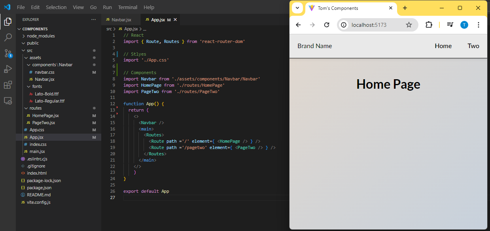

# Basic Vite App with routing
*By DevTomUK*  
[DevTomUK - Github](https://github.com/DevTomUK/BlankViteTemplate)

## Quick App setup

Start building an app quickly with this basic template.  
This template comes with a basic Navbar and two Routes to start building on.  

File structure:  

## Installation:

To create a fork of the repository, click the Fork dropdown and select "Create a new fork".  

To clone the repo to your local machine, run the following code in a terminal:  

    git clone https://github.com/DevTomUK/BlankViteTemplate.git
    cd BlankViteTemplate
    npm i

### Contents:

- vite@latest installed
- react-router-dom installed
- App.css - Back to basics
- App.jsx - Added routes and navbar
- main.jsx - Added BrowserRouter wrapper
- index.html - Changed Title

### Changes Made:

- Created basic Navbar component with Links to routes
- Styled Navbar with basic external styling
- Created basic HomePage and PageTwo components
- Created two routes - "/" and "/pagetwo"
- Added Lato font